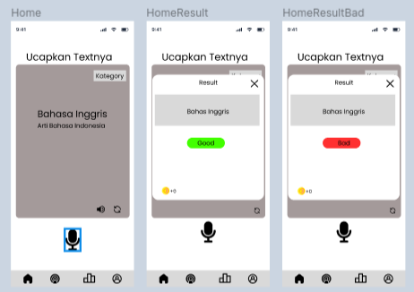

# Welcome to FluentIn: Speak Languages Easily

## 🌐 About FluentIn

FluentIn is more than just a language learning app. We innovate in language education by focusing on real-life situations. Designed to equip you with practical speaking skills, FluentIn enables you to communicate confidently across various real-world contexts, like home, school, or social situations.

## 📷 Peek into the  App
1, Initial Interface
   

2. Learning Experience
   

## 🚀 Key Features

FluentIn offers unique, speaking-focused features:
- **Situation-Based Learning**: Our modules are tailored to specific real-life scenarios, helping you learn languages in the contexts you'll actually use them.
- **Advanced Speech Recognition Technology**: Our state-of-the-art technology aids in refining pronunciation and intonation.
- **Practical and Relevant Lessons**: We emphasize language learning that's not just theoretical but immediately applicable to your daily life.

## 💡 Our Vision

At FluentIn, our vision is to empower everyone to confidently speak a new language in situations that matter to them. We believe that language learning should be directly connected to the real world, and that's exactly what we offer - real, relevant, and speaking-focused learning.

## 🤝 Contribute

We are always open to new ideas and contributions that can enrich the learning experience at FluentIn. If you're passionate about language learning and want to contribute, please visit our [Contributors' Guide](LINK TO CONTRIBUTORS' GUIDE).

## 📫 Contact Us

For inquiries, collaborations, or suggestions, feel free to contact us at [fluentin.official@gmail.com](mailto:fluentin.official@gmail.com).

Join us at FluentIn and start speaking a new language with confidence in the real situations you face every day!
